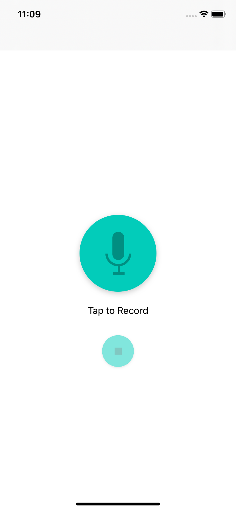
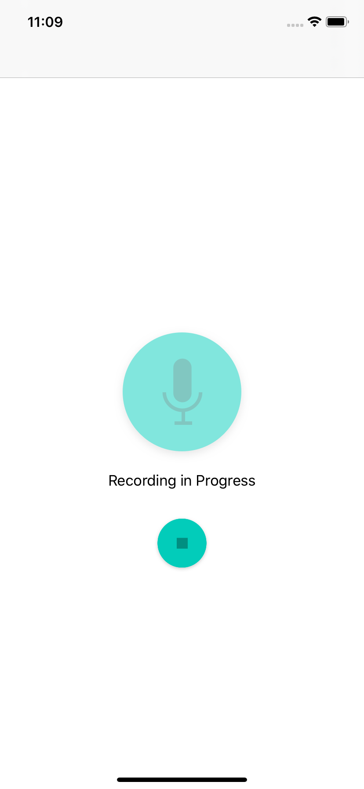
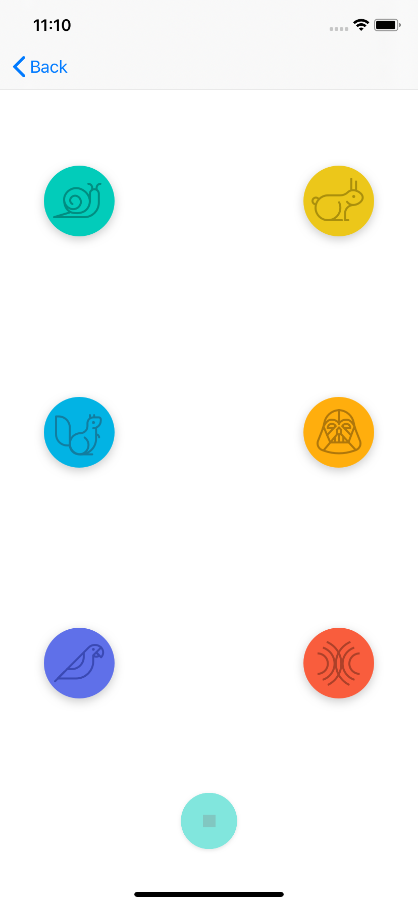

# PitchPerfect

### Udacity iOS Developer Nanodegree Program Project 1

```Swift
review complete ✅
```

 ## Screenshots
 > "final project"
 <p float="left">
 
  
       
 </p>


## Credits
Original graphical assets were provided by Udacity.
The concept for this app was presented during the iOS Nanodegree programme provided by Udacity.
